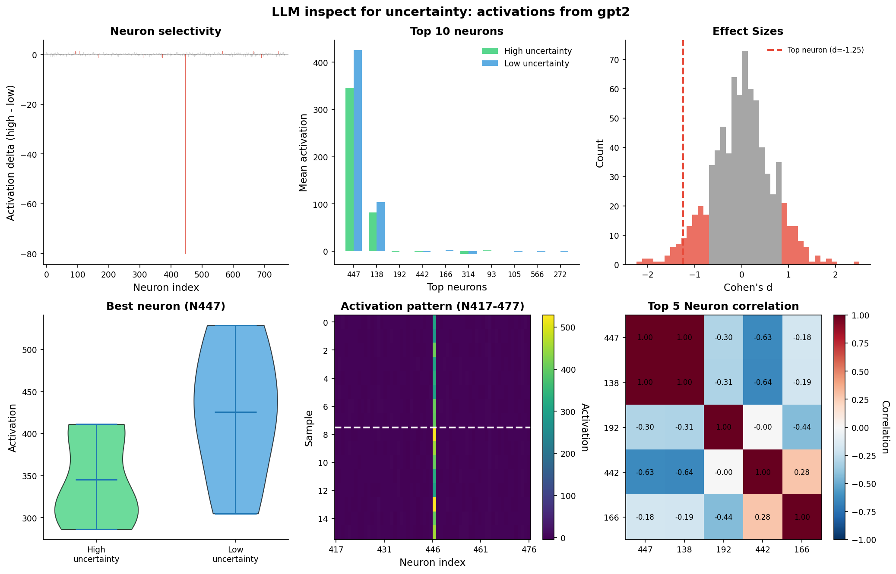

## LLM inspect: interrogate open model layer activation patterns

### Overview

Extract neuron activations to identify which neurons encode some state.

### Quick Start

```bash
uv pip install torch nnsight numpy matplotlib tqdm
uv run src/find_activations.py
```

### TL;DR

1. Load model via NNsight (`LanguageModel` wrapper)
2. Trace activations from a target layer using NNsight's context manager
3. Extract activations for select prompts (eg: 8 uncertain + 8 certain)
4. Identify selective neurons using statistical analysis

### Output

The following plots are generated for visual inspection of the results:

1. State-specific activations across all neurons
2. Top selective neurons
3. Effect size distribution (Cohen's d)
4. Highest activation distribution
5. Activation pattern heatmap
6. Correlation map (top selective neurons)

### Activation Extraction

```python
def get_layer_activation(model: LanguageModel, prompt: str,
                         layer_idx: int) -> np.ndarray:
    """Extract mean-pooled hidden states from a single transformer block.

    Returns a numpy array of shape (hidden_dim,) — the per-prompt activation,
    mean-pooled across the sequence dimension.
    """
    with model.trace(prompt):
        # GPT-2 block output is a tuple; [0] is the hidden state tensor
        # of shape (batch, seq_len, hidden_dim). Mean across seq_len.
        activation = model.transformer.h[layer_idx].output[0].mean(dim=1).save()
    # Shape: (batch=1, hidden_dim) -> squeeze to (hidden_dim,)
    return activation.squeeze(0).detach().cpu().numpy()
```

NNsight's `trace` context wraps the forward pass and exposes layer outputs as proxies; `.save()` retains the realized tensor after the context exits. No manual hook registration or lifecycle management.

### Example

**Model**: GPT-2 Small

- 12 transformer layers
- 768 hidden dimensions (neurons per layer)
- 124M total parameters

**Activation Source**:

- Traced from `model.transformer.h[layer_idx]` during forward pass
- Extracts hidden states: `(batch_size, sequence_length, 768)`
- Averages over sequence: `(batch_size, 768)`

**Result**:

